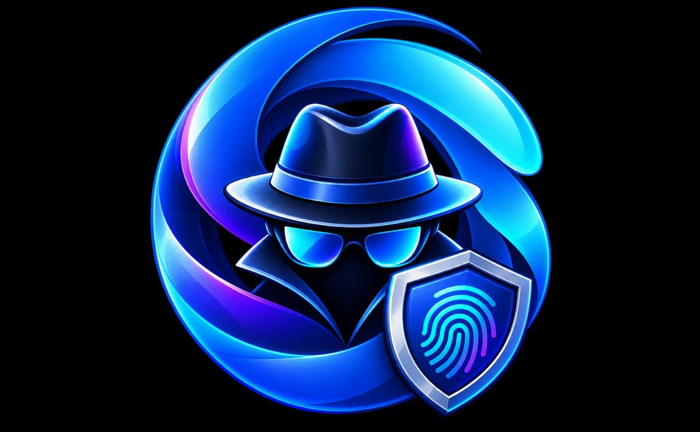

  
  <h1>PrfNoir</h1>
  <strong>Anti-Detect Browser</strong>
   
  <a href="https://lunex.io.vn">lunex.io.vn</a>

 

## Features

- Unlimited browser profiles: each fully isolated with its own fingerprint, cookies, extensions, and data
- Anti-detect Chromium engine: powered by [Wayfern](https://wayfern.com), a privacy-focused Chromium fork whose fingerprint spoofing is not detected by Cloudflare, reCaptcha v3, or other browser fingerprinting and anti-bot services
- DNS AdBlocker: block ads, trackers, and other unwanted content with per-profile DNS blocking
- Proxy support: HTTP, HTTPS, SOCKS4, SOCKS5 per profile, with dynamic proxy URLs
- VPN support: WireGuard configs per profile
- Local API & MCP: REST API and [Model Context Protocol](https://modelcontextprotocol.io) server for integration with Claude, automation tools, and custom workflows
- Profile groups: organize profiles and apply bulk settings
- Import profiles: migrate from Chrome, Edge, Brave, or other Chromium browsers
- Cookie & extension management: import/export cookies, manage extensions per profile
- Default browser: set PrfNoir as your default browser and choose which profile opens each link
- Cloud sync: sync profiles, proxies, and groups across devices (self-hostable)
- E2E encryption: optional end-to-end encrypted sync with a password only you know
- Zero telemetry: no tracking or device fingerprinting

## Install

<!-- install-links-start -->
### Windows

Download the latest installer from [lunex.io.vn](https://lunex.io.vn).
<!-- install-links-end -->

## Self-Hosting Sync

Run your own sync server to sync profiles, proxies, and groups across devices for free. See the [Self-Hosting guide](https://lunex.io.vn/docs/self-hosting) for Docker-based setup instructions.

## Contact

For questions or support, email [contact@lunex.io.vn](mailto:contact@lunex.io.vn).
